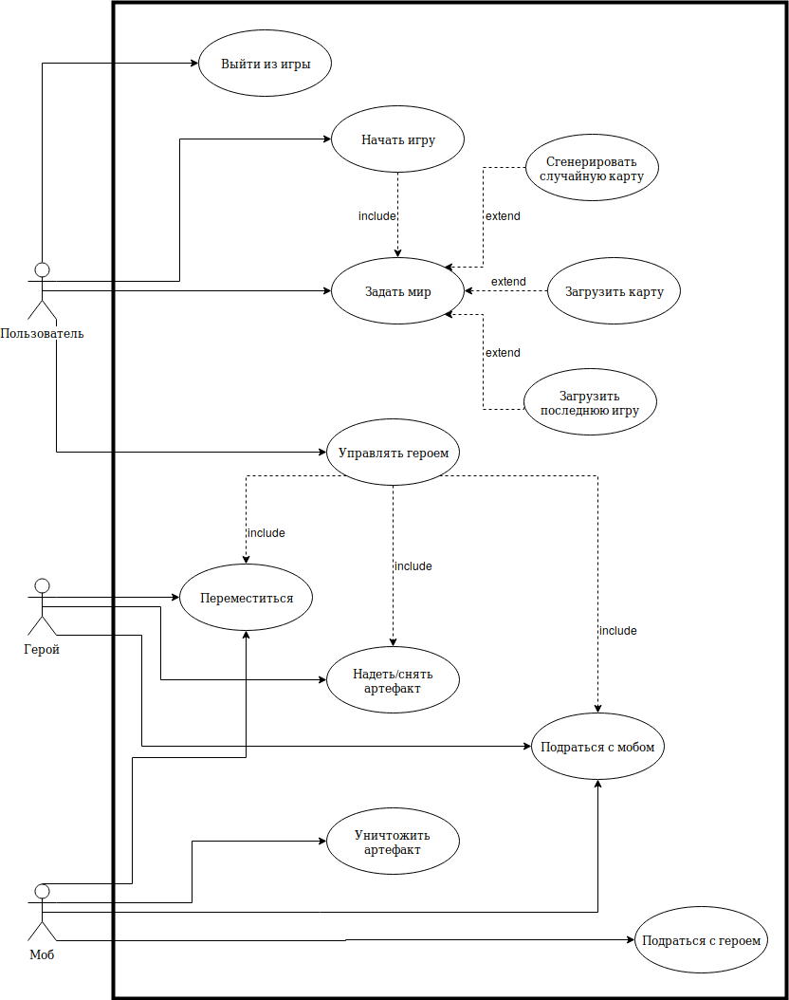
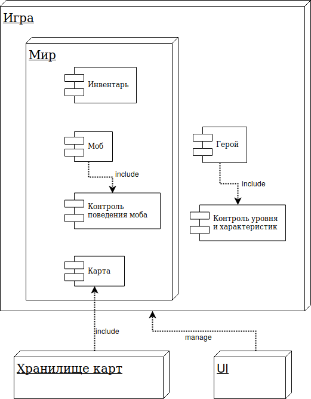
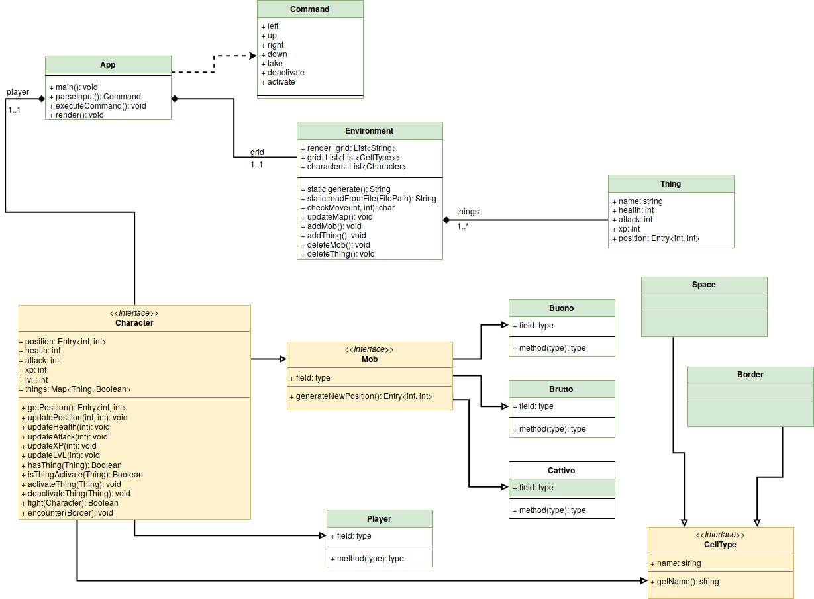

# Документация игры Roguelike

## Команда
- Рябушев Антон
- Артемьева Ирина

## Общие сведения о системе
Компьютерная игра в жанре RogueLike.
Жанр характеризуется:
- Простой тайловой или консольной графикой
- Активным использованием случайной генерации
- Перманентной смертью персонажа и невозможностью загрузить предыдущее сохранение
- Чрезвычайно развитым набором игровых правил
- Высокой свободой действий персонажа (“игры-песочницы”)

## Architectural drivers

### Функциональные требования
- Персонаж игрока способен перемещается по карте; управление с клавиатуры
- Карта генерируется "на лету", но может грузиться и из файла
- Характеристики:
  - здоровье - сила атаки моба для победы над игроком
  - сила атаки - размер урона мобу при одном ударе
  - XP - опыт - количество шагов, сделанных игроком
  - уровень игрока - зависит от количества шагов, сделанных игроком: уровень повышается на 1 каждые 10 шагов
- Персонаж может использовать артефакты для временного изменения своих характеристик:
  - броня/одежда/обувь
  - оружие
  - волшебные вещи
- Есть несколько видов мобов, способных перемещаться по карте:
  - агрессивные - ходят за игроком
  - трусливые - убегают от игрока
  - пассивные - стоят на месте
- Боевая система: движущиеся объекты, пытающиеся занять одну клетку карты, атакуют друг друга

### Бизнес-ограничения
- Команда из двух человек
- Отсутствие финансовой поддержки
- Занятость сотрудников составляет 7 часов в неделю
- Сроки выполнения - 2 месяца

### Качественные характеристики системы
- Отсутствие ручного тестирования
- Отсутствие ревью кода

### Технические ограничения
- Исходники на Java, которые необходимо собрать
- 1 пользователь

## Роли и случаи использования

### Описание типичного пользователя
 - начинает игру
 - открывает карту (выбирает случайно сгенерированную)
 - управляет героем (перемещается, собирает артефакты, дерётся с мобами)
 - выходит из игры

## Композиция (диаграмма компонентов)

### Описание диаграммы
 - игра управляется UI
 - игра состоит из генерируемого мира и героя
 - герой включает в себя модуль контроля уровня и характеристик
 - мир состоит из модулей генерации следующих вещей: артефакты, карты, моба
 - моб включает в себя модуль контроля поведения
 - карта может подгружаться из хранилища карт

## Логическая структура (диаграмма классов)

## Взаимодействия и состояния
### Диаграмма последовательностей

### Диаграмма конечных автоматов

